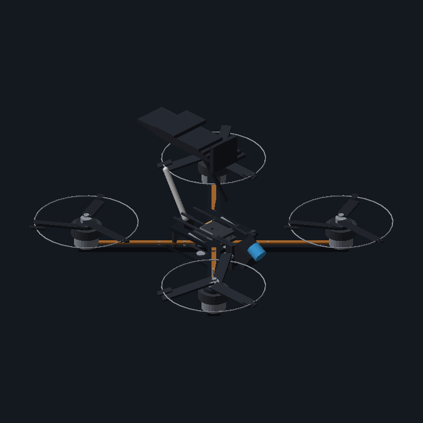
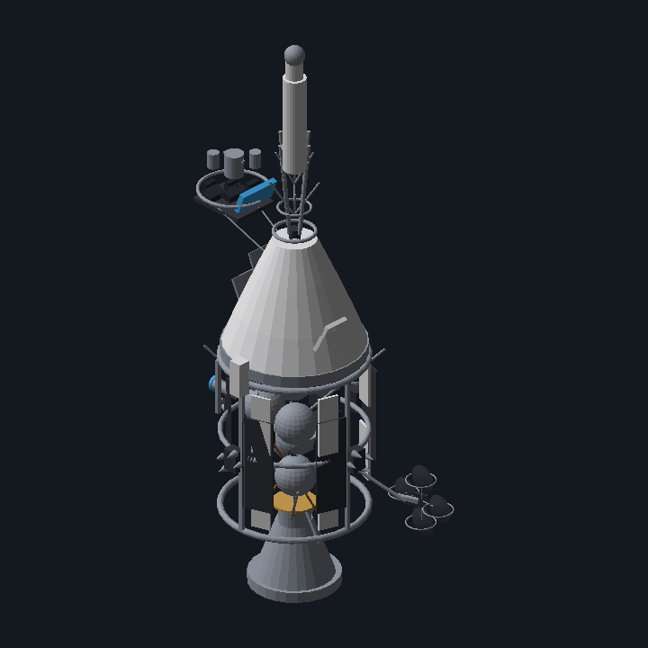
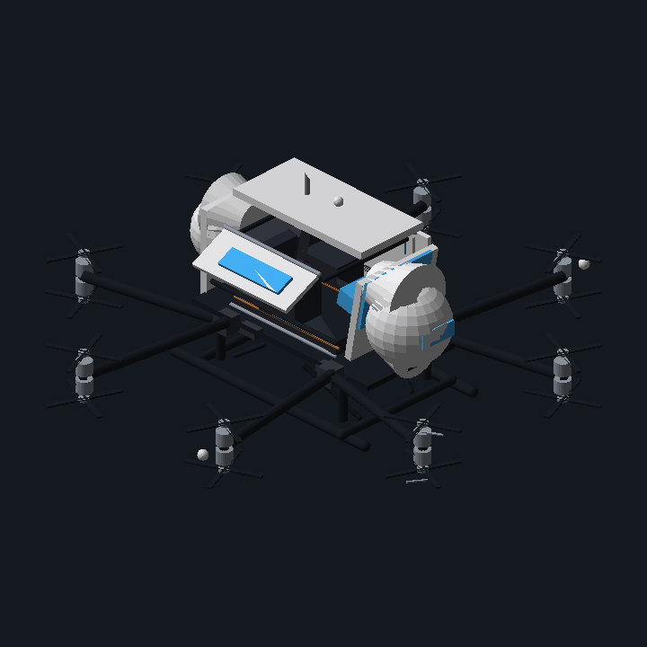
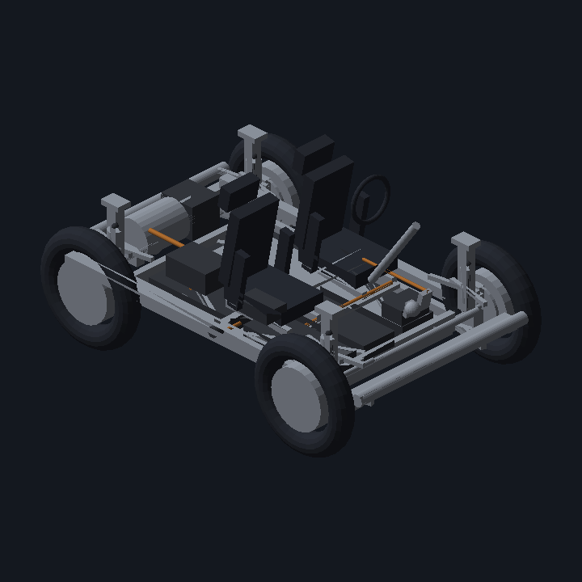
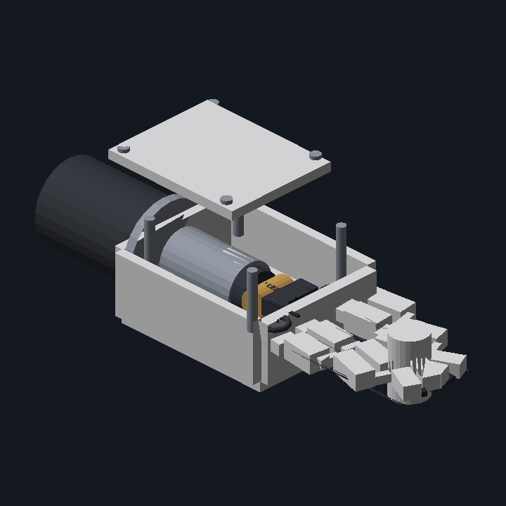
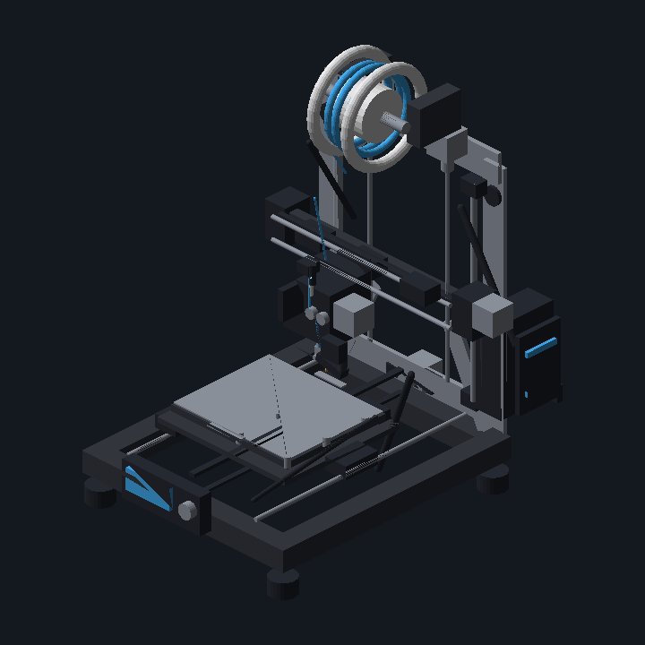
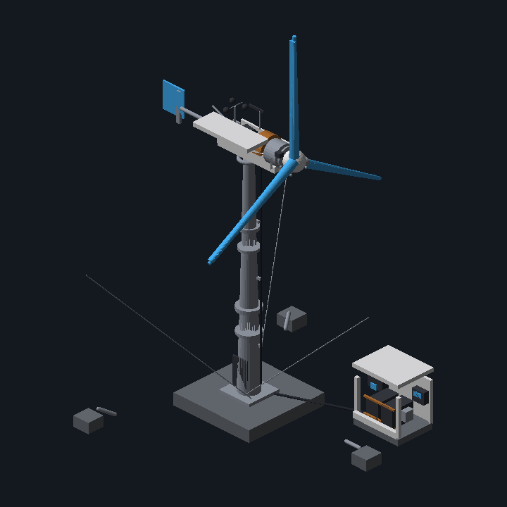
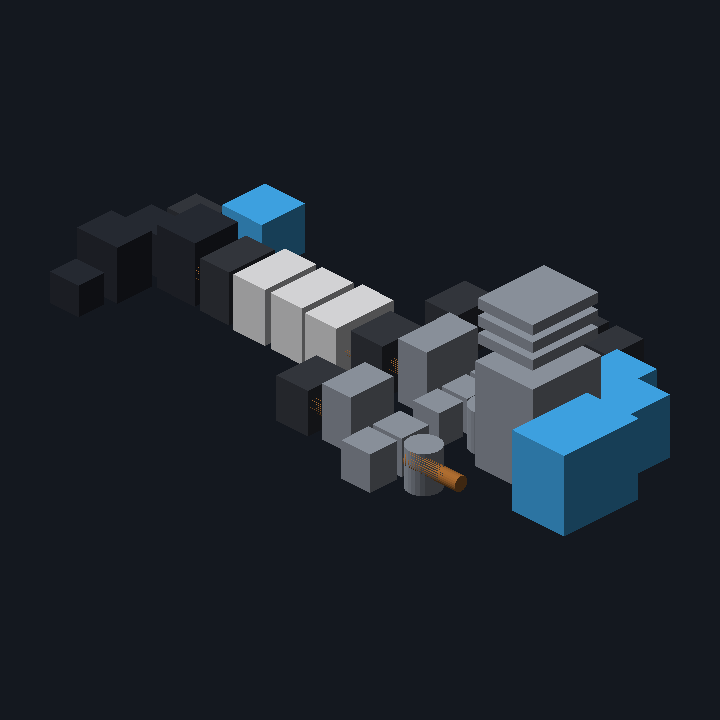

<div align="center">

# visually-3d

### Describe a machine — get an inspectable 3D model in your browser.

**Powered entirely by the Claude (or Codex) CLI you already have. No API keys. No cloud. No accounts.**

[](https://www.npmjs.com/package/visually-3d)
[](https://github.com/NyxFoundation/visually-3d/actions/workflows/ci.yml)
[](https://nodejs.org)
[](https://threejs.org)
[](#license)
[](#contributing)

```bash
npx visually-3d
```

<br/>

<table>
  <tr>
    <td align="center"><br/><sub><b>Quadcopter UAV</b></sub></td>
    <td align="center"><br/><sub><b>Apollo Command/Service Module</b></sub></td>
    <td align="center"><br/><sub><b>EHang 216-S eVTOL</b></sub></td>
    <td align="center"><br/><sub><b>Tabby EVO open EV platform</b></sub></td>
  </tr>
  <tr>
    <td align="center"><br/><sub><b>OpenHand robotic actuator</b></sub></td>
    <td align="center"><br/><sub><b>Prusa i3 MK3S 3D printer</b></sub></td>
    <td align="center"><br/><sub><b>50&nbsp;kW wind turbine</b></sub></td>
    <td align="center"><br/><sub><b>XiangShan RISC-V floorplan</b></sub></td>
  </tr>
</table>

<sub>Every model above started as a single text prompt, was refined by the tool's self-improvement loop, then explored live in the browser.<br/>These are exact offscreen renders of the generated scenes — <a href="public/samples">browse the source JSON →</a></sub>

<!--
  📹 Maintainers: drop a screen-recording of the live WebGL viewer here for the
  full "wow". Record the browser at http://localhost:3131, save it as
  docs/assets/demo.gif, and uncomment:
  <p></p>
-->

</div>

---

## What it does

Type a machine name (or paste a URL) and `visually` asks **your local Claude CLI** to reason about the machine like a mechanical engineer and emit a structured scene of parts — shapes, positions, materials, roles, and how they connect. The result renders instantly as an **inspectable** [react-three-fiber](https://github.com/pmndrs/react-three-fiber) scene: orbit around it, click a part to read what it is, trace its connections.

Then keep going:

- **Refine it** — a recursive self-improvement loop renders the scene offscreen, lets the model critique its own work *visually* as well as structurally, and writes back a better version, scoring each pass until it converges.
- **Check it** — open it in the browser, or render a headless contact-sheet PNG for a quick look or for CI.
- **Share it** — open a pull request adding your scene to the public gallery, using your own GitHub login.

## Why local?

This tool never handles an API key. All model calls go through whatever `claude` (or `codex`) is already on your `$PATH`, using the subscription / OAuth you've already set up. The Node process only:

- serves the built React frontend, and
- spawns `claude -p "<prompt>"` as a subprocess, streaming its output back to the browser over SSE.

No telemetry. No backend. No accounts. The sample gallery works even with no CLI installed.

## Prerequisites

- **Node.js 18+**
- **[Claude CLI](https://docs.claude.com/en/docs/claude-code)** (or **[Codex CLI](https://github.com/openai/codex)**) on your `$PATH` to generate or refine scenes — the gallery works without it.
- **[GitHub CLI](https://cli.github.com)** (`gh`) only if you want to `upload` scenes via pull request.

```bash
claude --version    # verify your CLI is installed + authenticated
```

## Quick start

```bash
npx visually-3d                      # opens http://localhost:3131
```

or install it:

```bash
npm install -g visually-3d
visually-3d
```

Use `--no-open` (or `VISUALLY_NO_OPEN=1`) to skip auto-opening the browser, and `PORT=…` to change the default `3131` (it probes the next 15 ports if one's taken).

## CLI

`visually-3d` is a small set of subcommands. With no subcommand it starts the GUI.

```bash
visually create "Apollo CSM"      # generate a new scene from a text prompt
visually check apollo-csm         # open it in the browser to inspect
visually check apollo-csm --png   # …or render a headless 2×2 contact-sheet PNG
visually improve apollo-csm 5     # recursively self-improve it (up to 5 passes)
visually upload apollo-csm        # open a PR adding it to the samples gallery
visually serve                    # the GUI (default when no subcommand)
```

Scenes you create live in a workspace at **`~/.visually-3d/scenes/`** (override with `$VISUALLY_HOME`). They show up in the gallery automatically — no rebuild needed.

<details>
<summary><b>Command reference</b></summary>

### `create` — generate

```bash
visually create "<machine name>" [--hint <text>] [--url <url>] \
                                 [--driver claude|codex] [--id <id>] [--force]
```

Runs your local `claude -p` (or `codex exec` with `--driver codex`), validates the output against the scene schema, and writes `~/.visually-3d/scenes/<id>.json`.

### `improve` — recursive self-improvement

```bash
visually improve <scene> [iterations] [--driver codex|claude] [--model <m>]
```

Each pass renders the scene to an offscreen contact-sheet PNG, has the model critique it **visually** *and* from the JSON, then writes back an improved scene — stopping on convergence, a score plateau, or the iteration cap (default 4). The full per-iteration history (prompt, render, thinking trace, before/after) is kept under `~/.visually-3d/runs/`.

### `check` — quick local inspection

```bash
visually check <scene>                            # launch the GUI
visually check <scene> --png [--out file.png]     # headless render, no GPU
```

### `upload` — contribute to the gallery

```bash
visually upload <scene> [--repo owner/name] [--title <t>] [--dry-run]
```

Uses your own `gh` auth to fork the repo (if needed), add the scene under `public/samples/`, register it in `index.json`, and open a pull request. `--dry-run` prepares the commit locally without pushing.

</details>

## How it works

```
Browser ──POST /api/analyze/stream──▶ Node server ──spawn──▶ claude -p "<prompt>"
        ◀──── SSE: log / result / error ────────────────────── stdout/stderr
        ──▶ React + three.js renders the MachineSceneDescriptor
```

The self-improvement loop closes a second feedback path: a dependency-free, GPU-free rasterizer (`scripts/render-scene.mjs`) turns a scene into a contact-sheet image so the model can *see* what it built — opaque faces mean a part buried inside a box is genuinely hidden in the render, which is exactly what makes "if you can't see it, the scene is hiding it" a usable critique.

## Scene schema

Every scene is a [`MachineSceneDescriptor`](./docs/schema.json):

```ts
{
  machine_name: string
  assembly_instructions?: string
  metadata?: object
  parts: Array<{
    id: string
    name: string
    shape: 'box' | 'cylinder' | 'sphere' | 'cone' | 'torus' | 'capsule' | 'complex'
    position: [number, number, number]
    rotation?: [number, number, number]   // Euler radians, optional
    size: number[]
    material: string
    role: string
    connections?: string[]
  }>
}
```

## Project layout

```
visually-3d/
├── bin/visually.js        CLI dispatcher (serve / create / improve / check / upload)
├── lib/                   Subcommands + shared scene/workspace helpers
│   ├── serve.js           HTTP server: static + /api + workspace-merged /samples
│   ├── create.js          Generate a scene via the local Claude/Codex CLI
│   ├── improve.js         Drive the recursive self-improve loop
│   ├── check.js           Browser / headless-PNG inspection
│   ├── upload.js          Fork + PR a scene to the gallery via `gh`
│   ├── scene.js           Schema validation, JSON extraction, index derivation
│   └── paths.js           Package paths + ~/.visually-3d workspace resolution
├── server/analyst.js      System prompt, `claude -p` spawn + SSE, JSON extraction
├── scripts/               Offscreen renderer + self-improve loop (shipped)
├── prompts/self-improve.md  Self-improvement rubric/instructions
├── src/                   React + three.js frontend
├── public/samples/*.json  Showcase scenes (built into dist/)
└── dist/                  Built frontend (shipped with the npm package)
```

## Develop from source

```bash
git clone https://github.com/NyxFoundation/visually-3d.git
cd visually-3d
npm install        # or: bun install
npm run build      # required before `serve` (builds dist/)
```

Then run any of:

```bash
node bin/visually.js serve            # or any subcommand
node bin/visually.js create "Drone"
npm run serve                          # alias for `serve`
npm run cli -- create "Drone"          # pass subcommand args after `--`
npm link && visually-3d serve          # use the real global command
```

`create`, `improve` and `check --png` don't need a build — only the browser GUI (`serve` / `check`) requires `dist/`.

Hot-reloading frontend dev loop:

```bash
npm run build && npm start   # terminal 1: production server on :3131
npm run dev                  # terminal 2: Vite on :5173, proxies /api → :3131
```

## Deploy the gallery (optional)

The static bundle (gallery only — no server, no CLI) deploys to Cloudflare Workers:

```bash
npx wrangler login
npm run deploy               # builds + publishes dist/ to the "visually-3d" Worker
```

The deployed build detects the absence of `/api/health` and hides the Analyze input automatically.

## Contributing

PRs are welcome — especially **new sample scenes**. The easiest path:

```bash
visually create "<your machine>"
visually improve <id>
visually upload <id>            # opens the PR for you
```

…or by hand: drop a JSON file under `public/samples/`, register it in `public/samples/index.json`, and open a PR.

## License

[MIT](#license) © NyxFoundation
