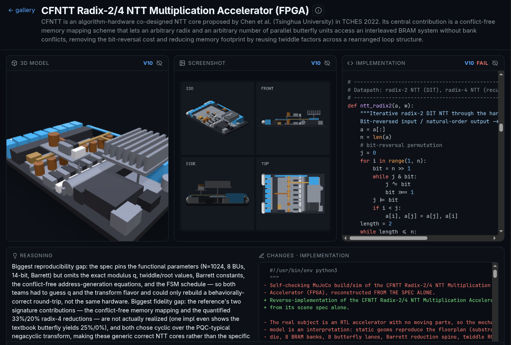
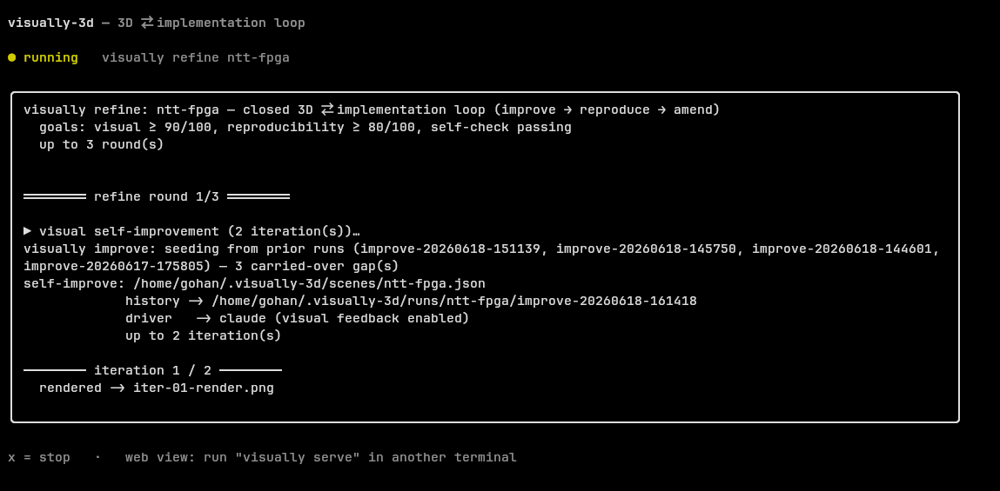

<div align="center">

# visually-3d

### Describe a machine in words — get an inspectable 3D model *and* a verified, reproducible implementation.

**Visioned Vibe Coding for hardware, chips, and algorithms — powered entirely by the Claude (or Codex) CLI you already have. No API keys. No cloud. No accounts.**

[](https://www.npmjs.com/package/visually-3d)
[](https://github.com/NyxFoundation/visually-3d/actions/workflows/ci.yml)
[](https://nodejs.org)
[](https://threejs.org)
[](#license)

```bash
npx visually-3d
```

<br/>

<table>
  <tr>
    <td align="center"><br/><sub><b>Quadcopter UAV</b></sub></td>
    <td align="center"><br/><sub><b>Apollo Command/Service Module</b></sub></td>
    <td align="center"><br/><sub><b>EHang 216-S eVTOL</b></sub></td>
    <td align="center"><br/><sub><b>Tabby EVO open EV platform</b></sub></td>
  </tr>
  <tr>
    <td align="center"><br/><sub><b>OpenHand robotic actuator</b></sub></td>
    <td align="center"><br/><sub><b>Prusa i3 MK3S 3D printer</b></sub></td>
    <td align="center"><br/><sub><b>50&nbsp;kW wind turbine</b></sub></td>
    <td align="center"><br/><sub><b>XiangShan RISC-V floorplan</b></sub></td>
  </tr>
</table>

<sub>Every model above started as a single text prompt. <a href="public/samples">Browse the source JSON →</a></sub>

</div>

---

Type a machine name and `visually` opens it in your browser as an **inspectable** [react-three-fiber](https://github.com/pmndrs/react-three-fiber) scene — orbit around it, click a part to read what it is, trace its connections. Alongside the model sits its **reverse-implementation** (Verilog / Python) and the **verification** that the implementation actually checks out:

<div align="center">

<br/><sub><b>Detail view of the CFNTT Radix-2/4 NTT accelerator (FPGA)</b> — exploded 3D model, the spec-derived implementation, and the live verification panel, side by side for one scene.</sub>
</div>

## Visioned Vibe Coding

The 3D render is only half of it. A `visually-3d` scene is two things at once: a **3D model** (what the machine looks like) and a **spec** (the parameters, ports, operations, and named properties of the real system). The point of the tool is the loop that grows both together and keeps them consistent — describe a system in plain language, and watch a *checkable* artifact converge until it's both convincing to look at and faithfully reproducible. We call the loop **Visioned Self-Improvement**.

```
        ┌──────────────────────────────────────────────────────────┐
        │                                                          │
        ▼                                                          │
   ┌─────────┐     ┌───────────┐     ┌────────────────────┐    ┌───┴────┐
   │ improve │ ──► │ reproduce │ ──► │ verify (SMT / sim) │ ──►│ amend  │
   │ (visual)│     │ (N impls) │     │  + judge fidelity  │    │(→ spec)│
   └─────────┘     └───────────┘     └────────────────────┘    └────────┘
   render→critique  reverse-impl       run each impl's          write the
   →rewrite the     from the spec      self-check; LLM-judge     findings back
   scene            ALONE              reproducibility+fidelity  into the scene
```

- **improve** renders the scene offscreen and lets the model critique its own work *visually* as well as structurally, then rewrites it. (A part buried inside an opaque box is genuinely hidden in the render — *if you can't see it, the scene is hiding it.*)
- **reproduce** has N independent agents reverse-implement the system **from the spec alone**, runs each one through a backend (Z3 SMT for digital/compute subjects, MuJoCo physics for physical machines), and an LLM-judge scores two axes: **reproducibility** (could an engineer rebuild it with no guessing?) and **fidelity** (is it *this specific* paper/datasheet's system, not merely *a* working one?).
- **amend** routes the discovered values, resolved ambiguities, and counterexamples back into the scene's spec — so the *next* reproduce reads them, the independent implementations converge, and the score climbs. It quotes the source where it can, tags each fact's provenance, and never invents architectural detail the source doesn't support.

`refine` drives `improve → reproduce → amend` each round; `create` runs the same loop automatically after generating a draft, so a fresh scene is convincing *and* reproducible out of the box. Each round streams the model's reasoning live and prints `visual · repro (▲/▼) · fidelity · self-check · spec field count`:

<div align="center">

<br/><sub><b>The TUI driving <code>visually refine ntt-fpga</code></b> — the closed 3D ⇄ implementation loop, working toward <code>visual ≥ 90 · reproducibility ≥ 80 · self-check passing</code>.</sub>
</div>

**Keeping the loop honest.** A self-improving loop is only as trustworthy as the signal it grades itself on — and here `amend` writes into the very spec the self-check measures against, so a bad write can corrupt its own grading key (we hit exactly this: a wrong modular inverse folded into the spec made every faithful implementation fail). Three guards close that gap:

- **Arithmetic guard** — fully-numeric derived constants (`x = b⁻¹ mod q`, `bᵉ mod q = r`, `floor(a/b) = c`) are machine-checked and auto-corrected before they ever enter the spec, at every write/read point. No false constant survives on any path.
- **Honest verdicts** — a self-check that fails to *run* (syntax error, timeout, crash) is a harness fault, not a wrong implementation: it's classified, repaired once, and counted separately instead of silently tanking the score.
- **Ratchet** — each round keeps the best-scoring scene; the loop never ends worse than the best round it actually measured.

📐 **Full architecture:** [`docs/visioned-self-improvement.md`](docs/visioned-self-improvement.md) — the spec substrate, the return edge, the two verification axes, and automatic backend selection. Development history: [`docs/visioned-self-improvement-changelog.md`](docs/visioned-self-improvement-changelog.md) — including the failure modes the guards above were built to prevent.

## Why local?

This tool never handles an API key. All model calls go through whatever `claude` (or `codex`) is already on your `$PATH`, using the subscription / OAuth you've already set up. The Node process only serves the built React frontend and spawns `claude -p "<prompt>"` as a subprocess, streaming its output back to the browser over SSE. No telemetry, no backend, no accounts — and the sample gallery works even with no CLI installed.

## Prerequisites

- **Node.js 18+** to run the package (building from source needs **Node 20+**, a Vite requirement).
- **[Claude CLI](https://docs.claude.com/en/docs/claude-code)** (or **[Codex CLI](https://github.com/openai/codex)**) on your `$PATH` to generate, refine, or verify scenes — the gallery works without it.
- **[GitHub CLI](https://cli.github.com)** (`gh`) only if you want to `upload` scenes via pull request.
- *Optional:* a Python with `z3-solver` (auto-provisioned via `uv run --with z3-solver` when present) for the SMT backend. Verification degrades gracefully if neither is available.

```bash
claude --version    # verify your CLI is installed + authenticated
```

## Quick start

```bash
npx visually-3d                      # bare TTY → interactive TUI; otherwise the GUI on http://localhost:3131
```

or install it:

```bash
npm install -g visually-3d
visually-3d
```

Use `--no-open` (or `VISUALLY_NO_OPEN=1`) to skip auto-opening the browser, and `PORT=…` to change the default `3131` (it probes the next 15 ports if one's taken).

## CLI

Bare `visually` in a terminal launches the interactive TUI; with no subcommand in a non-TTY context it starts the GUI.

```bash
visually create "CFNTT Radix-2/4 NTT accelerator" --url https://tches.iacr.org/...
                                  # generate, then auto-run the closed refine loop
visually refine ntt-fpga --rounds 3   # closed 3D ⇄ implementation loop on an existing scene
visually reproduce ntt-fpga       # measure reproducibility + fidelity + self-check (no edits)
visually amend ntt-fpga           # fold the latest findings back into the spec
visually improve apollo-csm 5     # visual-only self-improvement (up to 5 passes)
visually check apollo-csm         # open it in the browser to inspect
visually check apollo-csm --png   # …or render a headless 2×2 contact-sheet PNG
visually upload apollo-csm        # open a PR adding it to the samples gallery
visually serve                    # the GUI (default in a non-TTY context)
```

Scenes you create live in a workspace at **`~/.visually-3d/scenes/`** (override with `$VISUALLY_HOME`). They show up in the gallery automatically — no rebuild needed. The full per-round history (prompts, renders, thinking traces, before/after, verification reports) is kept under `~/.visually-3d/runs/`.

Mode (`hardware` / `algorithm` / `architecture`) is auto-detected from the subject, and the verification backend is auto-selected from *what the subject is* — digital/compute → SMT, physical machine → sim. Override either with `--mode` / `--backend`.

<details>
<summary><b>Command reference</b></summary>

### `create` — generate, then close the loop

```bash
visually create "<machine name>" [--hint <text>] [--url <url>] \
                                 [--mode hardware|algorithm|architecture] \
                                 [--refine N | --no-refine] \
                                 [--driver claude|codex] [--id <id>] [--force]
```

Runs your local `claude -p` (or `codex exec` with `--driver codex`), validates the output against the scene schema, writes `~/.visually-3d/scenes/<id>.json`, stamps the auto-selected backend and the `--url` as `metadata.reference`, then runs ≥3 closed-loop refine rounds (`--no-refine` to skip, `--refine N` to set the count).

### `refine` — the closed 3D ⇄ implementation loop

```bash
visually refine <scene> [--rounds 3] [--visual 90] [--repro 80] [--iters 2] \
                        [--backend <id>] [--no-amend] [--driver claude|codex] [--model <m>]
```

Each round runs **improve → reproduce → amend**, seeding the visual pass with the previous round's verification gaps. Stops when the visual score *and* reproducibility both clear their thresholds and the self-check passes — or at the round cap.

### `reproduce` — measure reproducibility & fidelity

```bash
visually reproduce <scene> [--n 2] [--backend python-smt|sim] [--no-verify] [--model <m>]
```

N independent agents reverse-implement the scene **from the spec alone**; each implementation's self-check runs through the backend; an LLM-judge scores **reproducibility** (completeness of the spec) and **fidelity** (match to the specific source) without changing the scene.

### `amend` — fold findings back into the spec

```bash
visually amend <scene> [--n 2] [--backend python-smt|sim] [--no-verify] [--model <m>]
```

Takes `reproduce`'s missing fields, divergences, counterexamples, and fidelity gaps and writes concrete values into the spec substrate (`parts[].spec` / `metadata.spec`), routing each fact to the part it belongs to. The merged scene passes the same parse/validate gate as `create`, plus the arithmetic guard that verifies and auto-corrects any derived numeric constant, before it's committed.

### `improve` — visual-only self-improvement

```bash
visually improve <scene> [iterations] [--driver codex|claude] [--model <m>]
```

Renders the scene to an offscreen contact-sheet PNG, has the model critique it **visually** and from the JSON, then writes back an improved scene — stopping on convergence, a score plateau, or the iteration cap.

### `check` — quick local inspection

```bash
visually check <scene>                            # launch the GUI
visually check <scene> --png [--out file.png]     # headless render, no GPU
```

### `upload` — contribute to the gallery

```bash
visually upload <scene> [--repo owner/name] [--title <t>] [--dry-run]
```

Uses your own `gh` auth to fork the repo (if needed), add the scene under `public/samples/`, register it in `index.json`, and open a pull request. `--dry-run` prepares the commit locally without pushing.

</details>

## Scene schema

Every scene is a [`MachineSceneDescriptor`](./docs/schema.json) — geometry **plus** an optional functional spec:

```ts
{
  machine_name: string
  assembly_instructions?: string
  metadata?: {
    reference?: string                    // the source paper/datasheet (fidelity is judged against it)
    backend?: 'python-smt' | 'sim'        // auto-stamped at create time
    spec?: object                         // global spec facts
    [k: string]: unknown
  }
  parts: Array<{
    id: string
    name: string
    shape: 'box' | 'cylinder' | 'sphere' | 'cone' | 'torus' | 'capsule' | 'complex'
    position: [number, number, number]
    rotation?: [number, number, number]   // Euler radians, optional
    size: number[]
    material: string
    role: string
    connections?: string[]
    spec?: {                              // the functional genome — read & written by the loop
      params?: Record<string, number | string>
      widths?: Record<string, number>
      ports?: Array<{ name: string; dir: 'in' | 'out'; width: number }>
      ops?: string[]
      fsm?: string[]
      properties?: string[]
      notes?: string
    }
  }>
}
```

The schema is `.loose()` and every `spec` field is optional, so it's fully back- and forward-compatible: old geometry-only scenes still validate, and `amend` may add fields the schema doesn't yet name.

## Project layout

```
visually-3d/
├── bin/visually.ts        CLI dispatcher (tui / serve / create / refine / reproduce / amend / improve / check / upload)
├── lib/                   Subcommands + shared scene/workspace helpers
│   ├── serve.ts           HTTP server: static + /api + workspace-merged /samples
│   ├── create.ts          Generate a scene, then run the closed refine loop
│   ├── refine.ts          Loop driver: improve → reproduce → amend per round
│   ├── reproduce.ts       Reverse-implement from the spec; judge reproducibility + fidelity
│   ├── amend.ts           Return edge: fold verification findings back into the spec
│   ├── improve.ts         Visual self-improvement (offscreen render → critique → rewrite)
│   ├── backends/          Verification backends (python-smt via Z3, sim via MuJoCo)
│   ├── impls.ts           Canonical per-scene impl store under ~/.visually-3d/impls/
│   ├── check.ts           Browser / headless-PNG inspection
│   ├── upload.ts          Fork + PR a scene to the gallery via `gh`
│   ├── scene.ts           zod schemas + parse/validate/extract + spec coverage
│   ├── types.ts           Spec substrate types
│   └── paths.ts           Package paths + ~/.visually-3d workspace resolution
├── server/analyst.ts      System prompt, `claude -p` spawn + SSE, JSON extraction
├── lib/tui/app.ts         Ink + htm interactive control panel
├── scripts/               Offscreen renderer (shipped)
├── prompts/self-improve.md  Visual self-improvement rubric
├── src/                   React + three.js frontend (hash router, gallery + detail)
├── public/samples/*.json  Showcase scenes (built into dist/)
├── docs/                  Architecture write-ups + assets
└── dist/                  Built frontend (shipped with the npm package)
```

## Develop from source

```bash
git clone https://github.com/NyxFoundation/visually-3d.git
cd visually-3d
npm install        # or: bun install
npm run build      # required before `serve` (builds the CLI + dist/)
```

Then run any of:

```bash
node bin/visually.js serve            # or any subcommand
node bin/visually.js create "Drone"
npm run serve                          # alias for `serve`
npm run cli -- create "Drone"          # pass subcommand args after `--`
npm link && visually-3d serve          # use the real global command
```

`create`, `refine`, `reproduce`, `amend`, `improve`, and `check --png` don't need a frontend build — only the browser GUI (`serve` / `check`) requires `dist/`.

The CLI (`lib/ server/ bin/`) is TypeScript under `strict`, compiled **in place** to sibling `.js` (see `CLAUDE.md`). The gate before every commit:

```bash
npm run lint && npm run build && npm test && npm run smoke
```

Hot-reloading frontend dev loop:

```bash
npm run build && npm start   # terminal 1: production server on :3131
npm run dev                  # terminal 2: Vite on :5173, proxies /api → :3131
```

## Deploy the gallery (optional)

The static bundle (gallery only — no server, no CLI) deploys to Cloudflare Workers:

```bash
npx wrangler login
npm run deploy               # builds + publishes dist/ to the "visually-3d" Worker
```

The deployed build detects the absence of `/api/health` and hides the Analyze input automatically.

## Contributing

PRs are welcome — especially **new sample scenes**. The easiest path:

```bash
visually create "<your machine>"   # generates + refines through the closed loop
visually refine <id>               # run extra rounds if you want a higher score
visually upload <id>               # opens the PR for you
```

…or by hand: drop a JSON file under `public/samples/`, register it in `public/samples/index.json`, and open a PR.

## License

[MIT](#license) © NyxFoundation
